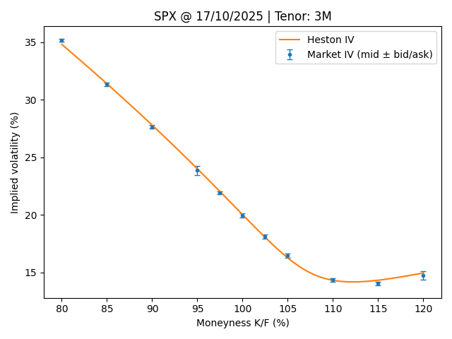
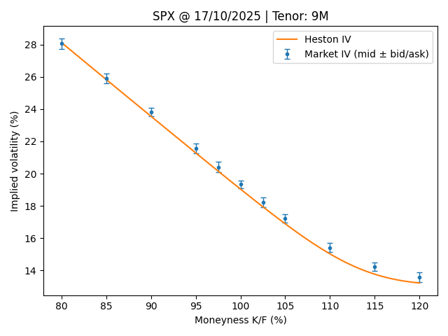

# Heston model

Implementation of the Heston (1993) stochastic volatility model.

### Pricing engines
- Gauss–Laguerre quadrature
- Sinh-accelerated contour integration

### Calibration
- Global + local optimization on implied-volatility surfaces

### Conventions
- Log-forward formulation
- Continuous dividend yield

### Module structre

```text
heston/
├── README.md
├── calibrator/
|   ├── callback.py
|   ├── checks.py
|   ├── loss.py
|   ├── refine_data.py
|   ├── reporting.py
│   └── main.py
└── pricer/
    ├── main.py
    ├── laguerre/
    |   └── price.py
    └── sinh/
        └── price.py
```

---

## Calibration output (IV smile fit)

<p align="center">
  
  
  
  
</p>

```
==============================================================================================
Heston check — Put/Call parity
==============================================================================================
Status        : PASS
tol_abs       : 1e-10
max|diff|     :  1.819e-12
mean(diff)    :  6.976e-14
std(diff)     :  5.352e-13

Initial seed: [ 0.044  3.     0.044  0.5   -0.5  ]

Starting Differential Evolution (global)
==========================================================================================
DE     iter       time          loss          best         Δabs       Δrel  stale   params
------------------------------------------------------------------------------------------
DE        1  00:00.547     4.910e-04     4.910e-04          inf        nan      0   v0= 0.0935963 kappa= 7.60585 theta= 0.0427178 sigma= 1.70063 rho=-0.648438
DE        2  00:00.798     4.910e-04     4.910e-04    0.000e+00   0.00e+00      1   v0= 0.0935963 kappa= 7.60585 theta= 0.0427178 sigma= 1.70063 rho=-0.648438
DE        3  00:01.004     4.910e-04     4.910e-04    0.000e+00   0.00e+00      2   v0= 0.0935963 kappa= 7.60585 theta= 0.0427178 sigma= 1.70063 rho=-0.648438
DE        4  00:01.293     3.003e-04     3.003e-04    1.907e-04   3.88e-01      0   v0= 0.117126 kappa= 7.49873 theta= 0.0370973 sigma= 1.7204 rho=-0.866851
DE        5  00:01.516     3.003e-04     3.003e-04    0.000e+00   0.00e+00      1   v0= 0.117126 kappa= 7.49873 theta= 0.0370973 sigma= 1.7204 rho=-0.866851
DE        6  00:01.740     2.664e-04     2.664e-04    3.385e-05   1.13e-01      0   v0= 0.0986393 kappa= 10.275 theta= 0.0415073 sigma= 1.92957 rho=-0.889774
DE        7  00:02.170     2.587e-05     2.587e-05    2.405e-04   9.03e-01      0   v0= 0.0843719 kappa= 2.99662 theta= 0.0690413 sigma= 1.99419 rho=-0.814622
DE        8  00:02.774     2.587e-05     2.587e-05    0.000e+00   0.00e+00      1   v0= 0.0843719 kappa= 2.99662 theta= 0.0690413 sigma= 1.99419 rho=-0.814622
DE        9  00:03.131     2.587e-05     2.587e-05    0.000e+00   0.00e+00      2   v0= 0.0843719 kappa= 2.99662 theta= 0.0690413 sigma= 1.99419 rho=-0.814622
DE       10  00:03.473     2.587e-05     2.587e-05    0.000e+00   0.00e+00      3   v0= 0.0843719 kappa= 2.99662 theta= 0.0690413 sigma= 1.99419 rho=-0.814622
DE       11  00:03.741     2.587e-05     2.587e-05    0.000e+00   0.00e+00      4   v0= 0.0843719 kappa= 2.99662 theta= 0.0690413 sigma= 1.99419 rho=-0.814622
DE       12  00:03.980     2.587e-05     2.587e-05    0.000e+00   0.00e+00      5   v0= 0.0843719 kappa= 2.99662 theta= 0.0690413 sigma= 1.99419 rho=-0.814622
DE       13  00:04.270     2.587e-05     2.587e-05    0.000e+00   0.00e+00      6   v0= 0.0843719 kappa= 2.99662 theta= 0.0690413 sigma= 1.99419 rho=-0.814622
DE       14  00:04.482     2.574e-05     2.574e-05    1.363e-07   5.27e-03      0   v0= 0.0801598 kappa= 2.52115 theta= 0.0724621 sigma= 1.86747 rho=-0.812284
DE       15  00:04.760     2.500e-05     2.500e-05    7.379e-07   2.87e-02      0   v0= 0.0840102 kappa= 2.85304 theta= 0.0701333 sigma= 1.95762 rho=-0.815444
DE       16  00:04.987     2.413e-05     2.413e-05    8.705e-07   3.48e-02      0   v0= 0.0792779 kappa= 2.60803 theta= 0.0746083 sigma= 1.86624 rho=-0.808373
DE       17  00:05.254     1.859e-05     1.859e-05    5.534e-06   2.29e-01      0   v0= 0.0735276 kappa= 2.25615 theta= 0.0735665 sigma= 1.64053 rho=-0.808074
DE       18  00:05.534     1.859e-05     1.859e-05    7.831e-09   4.21e-04      0   v0= 0.0748843 kappa= 2.28828 theta= 0.0745593 sigma= 1.67674 rho=-0.811458
DE       19  00:06.120     1.669e-05     1.669e-05    1.899e-06   1.02e-01      0   v0= 0.0718717 kappa= 1.93433 theta= 0.0774836 sigma= 1.55735 rho=-0.81312
DE       20  00:06.635     1.597e-05     1.597e-05    7.191e-07   4.31e-02      0   v0= 0.0713535 kappa= 1.78896 theta= 0.078762 sigma= 1.489 rho=-0.816675
DE       21  00:07.029     1.597e-05     1.597e-05    0.000e+00   0.00e+00      1   v0= 0.0713535 kappa= 1.78896 theta= 0.078762 sigma= 1.489 rho=-0.816675

Global method completed.

Starting L-BFGS-B (local refinement)
==========================================================================================
LBFGS  iter       time          loss   params
---------------------------------------------
LBFGS     1  00:00.080     1.595e-05   v0= 0.0712691 kappa= 1.78896 theta= 0.0786868 sigma= 1.48901 rho=-0.816685
LBFGS     2  00:00.127     1.595e-05   v0= 0.071254 kappa= 1.78896 theta= 0.078699 sigma= 1.48901 rho=-0.816688
LBFGS     3  00:00.163     1.595e-05   v0= 0.0711905 kappa= 1.78895 theta= 0.0787509 sigma= 1.489 rho=-0.816709

==============================================================================================
Heston calibration summary
==============================================================================================
Method        : laguerre | DE -> L-BFGS-B
Elapsed       : 00:07.193
Loss (init)   :  1.300565e-03
Loss (DE)     :  1.596757e-05
Loss (opt)    :  1.594852e-05
----------------------------------------------------------------------------------------------
Parameters (optimal)
----------------------------------------------------------------------------------------------
  v0         0.07119049851
  kappa      1.788954103
  theta      0.07875087076
  sigma      1.488999635
  rho       -0.816708721
----------------------------------------------------------------------------------------------
Δ vs init (x_opt - x_init)
----------------------------------------------------------------------------------------------
  v0         2.679601e-02
  kappa     -1.211046e+00
  theta      3.435638e-02
  sigma      9.889996e-01
  rho       -3.167087e-01
----------------------------------------------------------------------------------------------
Δ vs DE (x_opt - x_de)
----------------------------------------------------------------------------------------------
  v0        -1.630246e-04
  kappa     -3.968626e-06
  theta     -1.112798e-05
  sigma     -3.095182e-06
  rho       -3.323450e-05
----------------------------------------------------------------------------------------------
Sanity checks
----------------------------------------------------------------------------------------------
  Feller      : False  (2*kappa*theta > sigma^2)
==============================================================================================

==============================================================================================
Model columns added
==============================================================================================
Added columns : 'Heston price', 'Heston IV'
IV NaNs       : 0 / 77

==============================================================================================
Plot — IV smiles vs bid/ask (mid ± bid/ask) + model IV
==============================================================================================
```

---

## References

Heston, S. L. (1993).
A Closed-Form Solution for Options with Stochastic Volatility with Applications to Bond and Currency Options.
The Review of Financial Studies, 6(2), 327–343.
https://doi.org/10.1093/rfs/6.2.327

Gatheral, J. (2006).
The Volatility Surface: A Practitioner’s Guide.
Wiley Finance Series.
https://doi.org/10.1002/9781119202073

Albrecher, H., Mayer, P., Schoutens, W., & Tistaert, J. (2007).
The Little Heston Trap.
Wilmott Magazine, January, 83–92.

Ortiz Ramírez, A., Venegas Martínez, F., & Martínez Palacios, M. T. V. (2021).
Parameter calibration of stochastic volatility Heston’s model: constrained optimization vs. differential evolution.
Accounting and Management, 67(1), 309.
https://doi.org/10.22201/fca.24488410e.2022.2789


Boyarchenko, S. & Levendorskii, S. (2019).
Sinh-acceleration: Efficient Evaluation of Probability Distributions, Option Pricing, and Monte Carlo Simulations.
International Journal of Theoretical and Applied Finance, 03(22), 1950011.
https://doi.org/10.1142/S0219024919500110